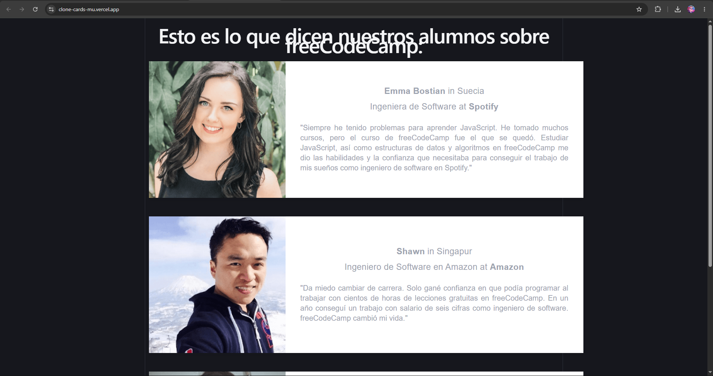

<div align="center">
<h1>Clone Cards — freeCodeCamp Testimonials</h1>
<p>Réplica de la sección de testimonios de <a href="https://www.freecodecamp.org"> freeCodeCamp </a>, construida con <strong>React 19</strong> y <strong>Vite 8</strong> como ejercicio de práctica de componentes reutilizables y props.</p>
</div>



> 🔗 **Demo en vivo:** [clone-cards-mu.vercel.app](https://clone-cards-mu.vercel.app)

---

## Descripción

La aplicación muestra tarjetas de testimonio de antiguos alumnos de freeCodeCamp. Cada tarjeta es un componente `<Testimonial />` independiente que recibe sus datos a través de props, lo que permite añadir, eliminar o modificar testimonios sin tocar la lógica del componente.

**Objetivos de aprendizaje cubiertos:**

- Creación de componentes funcionales en React.
- Paso de datos mediante props.
- Importación dinámica de imágenes con `import.meta.glob` de Vite.
- Estilizado con CSS modular (un archivo de estilos por componente).

---

## Tecnologías

| Categoría      | Herramienta                          |
| -------------- | ------------------------------------ |
| Librería UI    | React 19                             |
| Bundler        | Vite 8                               |
| Compilador     | React Compiler (via `@rolldown/plugin-babel`) |
| Linter         | ESLint 10                            |
| Despliegue     | Vercel                               |

---

## Estructura del proyecto

```
clonecards/
├── public/
│   └── favicon.svg
├── src/
│   ├── assets/
│   │   └── img/            # Imágenes de los testimonios (.png)
│   ├── components/
│   │   └── Testimonial.jsx  # Componente reutilizable de tarjeta
│   ├── styles/
│   │   ├── index.css        # Estilos globales y variables CSS
│   │   └── Testimonial.css  # Estilos del componente Testimonial
│   ├── App.jsx              # Componente raíz
│   └── main.jsx             # Punto de entrada
├── index.html
├── vite.config.js
├── package.json
└── README.md
```

---

## Instalación y uso

**Requisitos previos:** Node.js ≥ 20.19

```bash
# 1. Clonar el repositorio
git clone https://github.com/webcartaonline/CloneCards.git

# 2. Acceder al directorio
cd clonecards

# 3. Instalar dependencias
npm install

# 4. Iniciar el servidor de desarrollo
npm run dev
```

### Scripts disponibles

| Comando           | Descripción                            |
| ----------------- | -------------------------------------- |
| `npm run dev`     | Inicia el servidor de desarrollo       |
| `npm run build`   | Genera la build de producción          |
| `npm run preview` | Previsualiza la build de producción    |
| `npm run lint`    | Ejecuta ESLint sobre el proyecto       |

---

## Cómo añadir un nuevo testimonio

Añadir una tarjeta nueva solo requiere dos pasos:

1. Colocar la imagen del testimonio en `src/assets/img/` con formato `.png`.
2. Añadir un nuevo componente `<Testimonial />` en `App.jsx` con las props correspondientes:

```jsx
<Testimonial
  name="Nombre"
  country="País"
  image="NombreArchivo"   // Sin extensión, debe coincidir con el .png
  role="Cargo profesional"
  company="Empresa"
  testimonial="Texto del testimonio."
/>
```

---

## Autor

**Juan Camilo Piamba Uribe**

[](https://github.com/webcartaonline)

---

## Licencia

Este proyecto es un ejercicio de aprendizaje y no está afiliado a freeCodeCamp.
